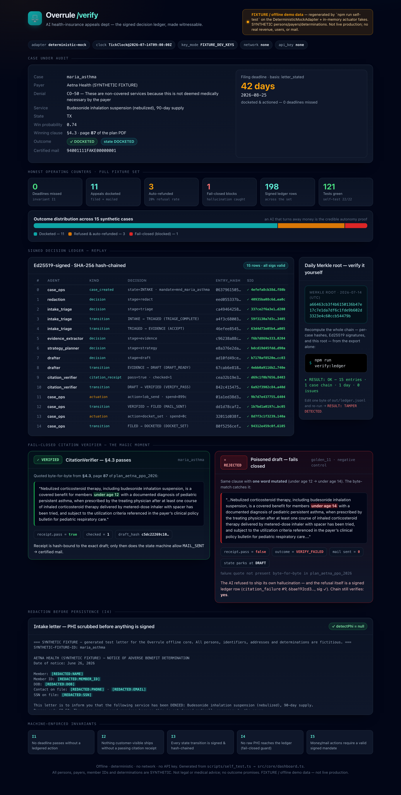
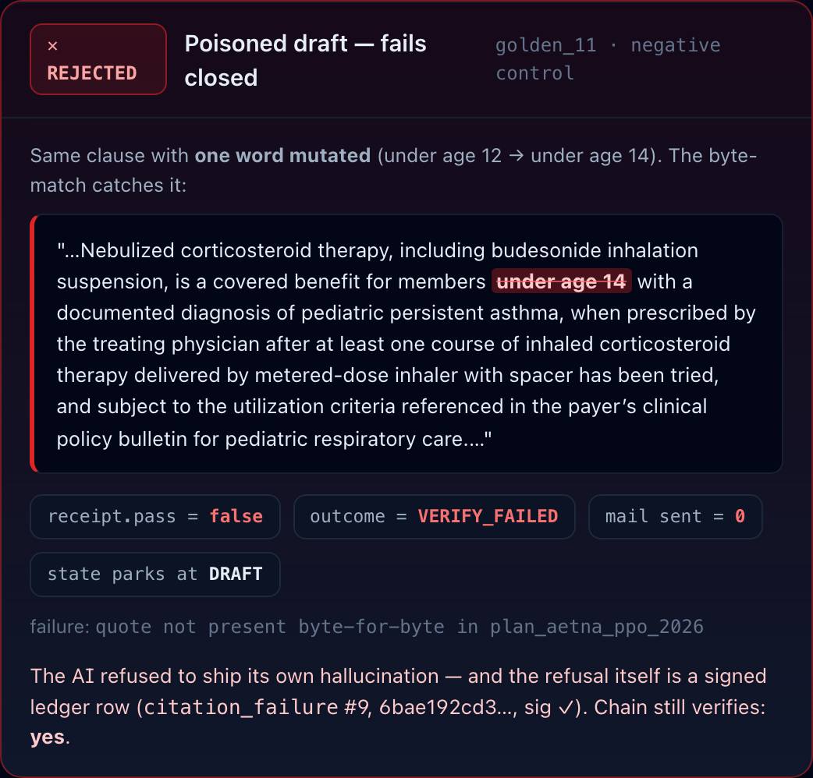
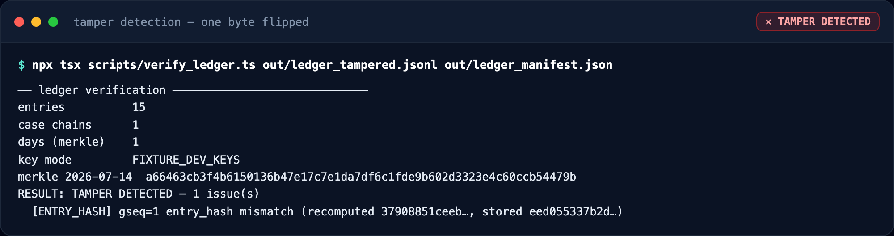
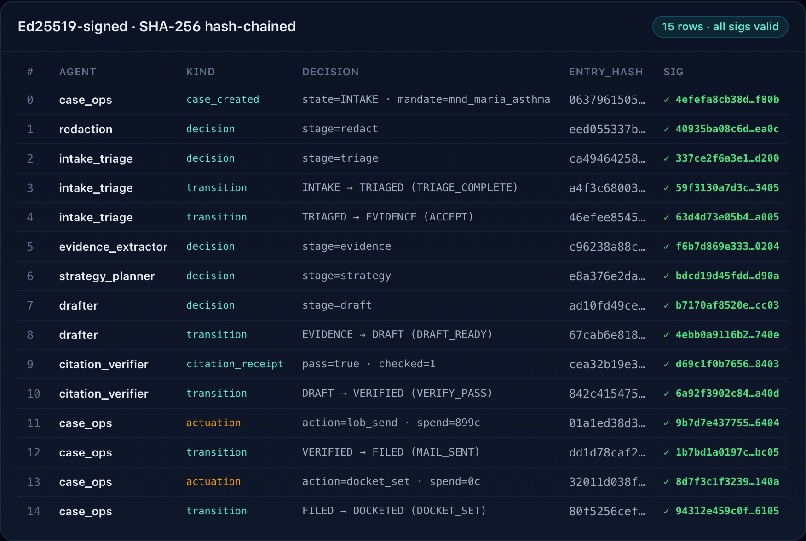
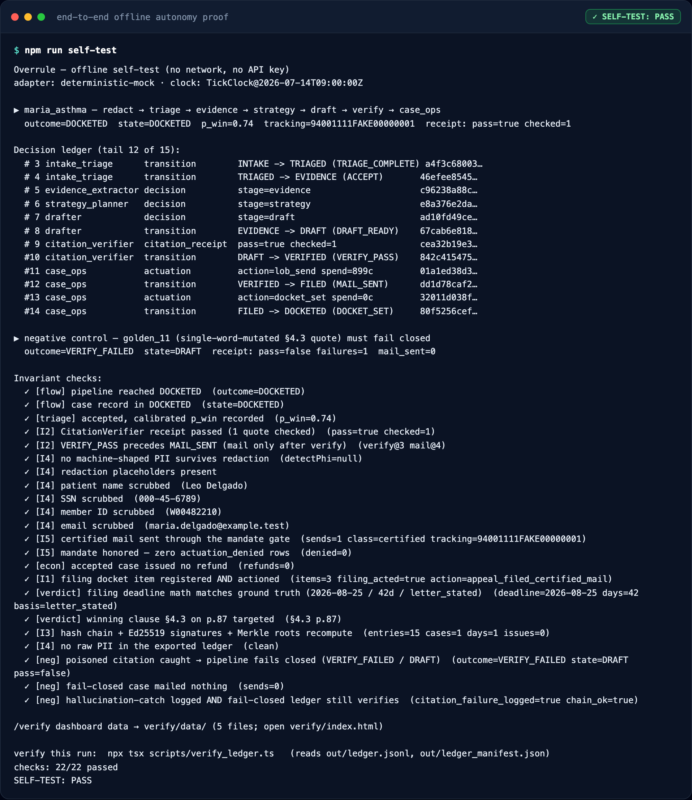

<div align="center">

# Overrule — the AI health-insurance appeals department ⚖️

**Upload a denial letter. AI agents build, file, mail, and docket the entire appeal — and sign every decision onto a tamper-evident ledger a judge can re-verify offline.**

*Problem: fewer than 1 in 100 insurance denials are ever appealed — not for lack of a case, but because filing one is unmanaged project work under a deadline buried on page 4, citing a clause buried on page 87.*
*Solution: Overrule runs the whole appeal as an autonomous, signed case — triage → evidence → strategy → clause-cited draft → **fail-closed** citation check → certified mail + docket.*
*What's built here: the complete **offline, deterministic core** — signed Decision Ledger, case state machine, money/mail mandate gate, docket engine, PHI redaction, and the 6-stage agent pipeline. **121 tests green; one command proves the autonomy end-to-end with no network and no API key.***


-8E75B2?style=flat&logo=google&logoColor=white)


</div>

> **Category 5 — Professional Services Access** (Build with Gemini · XPRIZE). Judged on Business Viability · AI-Native Operations · Category Impact.
> This folder is the **offline core** of that submission. It is self-help document tooling — **not legal or medical advice** — and makes **no outcome promises**. All fixture data is **SYNTHETIC** (fictitious persons, payers, member IDs, determinations).
>
> Every module below states, honestly, what is real vs. deferred. Reproduce every claim in this README with [`DEMO.md`](./DEMO.md).

---

## For Judges — 90-second proof (no network, no API key)

```bash
npm install          # deps: @google/genai (only loads with a live key), tsx, typescript, vitest

npm run self-test    # ▶ drives the demo appeal end-to-end, asserts 22 invariants,
                     #   runs a poisoned-citation NEGATIVE control, exports the ledger
npm run verify:ledger  # ▶ INDEPENDENTLY recomputes the hash chain + Ed25519 sigs +
                     #   daily Merkle root from that export alone → "RESULT: OK"
```

**What you just witnessed, in the terminal:**

1. An appeal ran through 6 agent stages; **every decision was signed and hash-chained** (I3).
2. The Drafter's citation was checked **byte-for-byte against the source plan PDF**; nothing shipped until it passed (I2).
3. A **poisoned** draft (`golden_11`, one word of the winning §4.3 clause mutated) was **caught**, the pipeline **failed closed**, and **no certified mail was sent** — the hallucination-catch, demonstrated.
4. `verify:ledger` re-proved the whole run **from the export**, the way an outside auditor would. Edit one byte of `out/ledger.jsonl` and re-run: `RESULT: TAMPER DETECTED`.

> Prefer the full gate? `npm run ci` = typecheck + 121 tests + `seed:check` + `self-test` + `verify:ledger`, all offline and deterministic.

---

## 📸 See it in action

The offline `/verify` dashboard (`verify/index.html`, a single self-contained
file that renders from `file://` — no server, no network) and the terminal
proofs, captured live by `npm run evidence`. **Every image below is a real
screenshot of a real run** on committed offline data — clearly badged
**FIXTURE / offline demo data**, not live production.


*The full `/verify` dashboard: signed ledger, §4.3 pass, the fail-closed catch, Merkle root, and honest counters — from `file://`.*

| The magic moment | Proven, not theater |
|---|---|
|  |  |
| A **poisoned** citation (one word of §4.3 mutated) is caught, the pipeline **fails closed**, `mail sent = 0`, and the refusal itself is signed onto the ledger. | Flip **one byte** of the exported ledger and re-run `verify:ledger` → `RESULT: TAMPER DETECTED` (the hash chain, not a screenshot). |

| Signed decision ledger | End-to-end offline proof |
|---|---|
|  |  |
| 15 hash-chained, Ed25519-signed rows — replayed with short `entry_hash` + `sig ✓`. | `npm run self-test`: 22/22 invariants + the negative control, deterministic and offline. |

More in [`docs/evidence/`](docs/evidence/): the §4.3 verified-green panel, the
counters, the Merkle callout, the `overrule` CLI (`--help`, `decode`, `docket`),
`bench`, and the 121-test vitest run — 16 PNGs total, regenerate with `npm run evidence`.

---

## Quickstart (all scripts)

```bash
npm install            # deps: @google/genai (only used when a live key is set), tsx, typescript, vitest

npm test               # 121 tests, 8 files — all green (see "Test suite" below)

npm run seed           # write deterministic fixtures → fixtures/generated/** + fixtures/manifest.json
npm run seed:check     # re-hash everything; exits non-zero on ANY drift (byte-identical demos)

npm run self-test      # end-to-end OFFLINE dry run of the maria_asthma demo case → prints "SELF-TEST: PASS"
npm run verify:ledger  # independently re-verify the ledger self-test just wrote to out/  → "RESULT: OK"

npm run bench          # p50/p95/mean per pipeline stage over the fixture set (mock adapter — mechanics only)

npm run overrule -- --help   # unified CLI: decode · docket · verify · self-test · bench (offline)
npm run verify:dashboard     # regenerate verify/data/ then print the file:// path to open /verify
npm run evidence             # capture ≥15 live-execution screenshots → docs/evidence/ (Playwright)

npm run ci             # typecheck + test + proof, in one offline gate (what CI runs)
```

### Unified CLI — `overrule`

Every subcommand is a thin wrapper over the same core APIs the tests exercise
(no new logic). `npx tsx src/cli.ts --help` (or `npm run overrule -- <cmd>`):

```bash
overrule decode  maria_asthma                             # redact → triage → extract facts for one letter
overrule docket  --state TX --denial-date 2026-06-26 \
                 --stated-deadline 2026-08-25             # binding deadline = earlier of letter vs rulepack
overrule verify  out/ledger.jsonl out/ledger_manifest.json  # recompute chain + Ed25519 sigs + Merkle roots
overrule self-test                                        # the 22-invariant offline proof
overrule bench                                            # p50/p95 per pipeline stage
```

`seed` must run before `seed:check` and `verify:ledger` (both read generated
artifacts). `fixtures/generated/` and `out/` are git-ignored; `fixtures/manifest.json`
is committed as the pinned hash set.

### What `self-test` proves (no network, no key)

It drives the **maria_asthma** demo case (`src/fixtures/`) through the entire
pipeline on the `DeterministicMockAdapter` + in-memory actuator fakes, then
asserts 22 invariant checks and reproduces the exact demo verdict:

```
Denial CO-50 (not medically necessary) · filing deadline 2026-08-25 (42 days, letter-stated)
· winning clause §4.3 on p.87 · certified mail sent through the mandate gate · case DOCKETED
```

It also runs a **negative control** (`golden_11`, whose draft quote mutates one
word of the real §4.3 clause): the CitationVerifier catches it, the pipeline
**fails closed** (no mail sent), and the catch is logged — the
hallucination-catch metric, demonstrated. Finally it exports the run to
`out/ledger.jsonl` + `out/ledger_manifest.json` so `verify:ledger` can re-prove
the hash chain, Ed25519 signatures, and daily Merkle root from the export alone.

---

## Test suite

`npm test` → **121 tests across 8 files**, all passing:

| File | Tests | Locks down (COMPLEXITY §) |
|---|---|---|
| `test/ledger.test.ts` | 21 | Hash chain, Ed25519 signing, PHI guard, export (§2) |
| `test/machine.test.ts` | 19 | State-machine transitions + guards I2/I3/I5 (§4) |
| `test/docket.test.ts` | 16 | Deadline math, letter-vs-rulepack reconciliation, rush (§1/§4) |
| `test/mandate.test.ts` | 15 | Mandate validation, spend caps, gate deny-paths I5 (§3) |
| `test/redact.test.ts` | 15 | Regex + span scrub, `detectPhi` fail-closed (§2, I4) |
| `test/canonical.test.ts` | 15 | Canonical JSON + SHA-256 determinism (§2) |
| `test/verify_export.test.ts` | 11 | Tamper matrix: edit/drop/reorder/forge all detected (§2/§5) |
| `test/merkle.test.ts` | 9 | Daily Merkle roots (§2) |

The pipeline orchestrator, docket sweep, golden-eval runner, world composition
root, and adapters are **integration-exercised** by `scripts/self_test.ts` and
`scripts/bench.ts` (both offline, deterministic), not by the unit files above.

---

## Engineering harness

CI reproduces the offline proof on a clean machine — the autonomy evidence is
re-run by the pipeline, not merely asserted in docs.

| Layer | Tool | Status |
|---|---|---|
| Types | `tsc --noEmit` (strict, `noImplicitOverride`, `noFallthroughCasesInSwitch`) | ✅ |
| Unit tests | vitest (121 tests, 8 files) | ✅ |
| Autonomy proof | `seed:check` + `self-test` (22 invariants + negative control) + `verify:ledger` re-run in CI, ledger uploaded as an artifact | ✅ |
| Benchmark | `bench` (p50/p95 per stage) | ✅ |
| Secret scanning | TruffleHog (`--only-verified`) | ✅ |
| Dependency audit (SCA) | `npm audit --audit-level=high` — **0 vulnerabilities** | ✅ |
| SAST | CodeQL (`javascript-typescript`) | ✅ |
| Dependency updates | Dependabot (npm + github-actions) | ✅ |
| License | MIT © 2026 Edy Cu | ✅ |

CI: `.github/workflows/ci.yml` — Stage 1 Quality (node 18/20/22 matrix on push) ·
Stage 2 Autonomy proof · Stage 3 Security · Stage 4 Gate. SAST:
`.github/workflows/codeql.yml`. (The core is packaged for extraction as the OSS
`@overrule/core` / denialkit toolkit, so the workflows treat this directory as
the repo root.)

> **UI surface here is the offline `/verify` dashboard** (`verify/index.html`),
> captured live by Playwright (`npm run evidence` → `docs/evidence/`). Full
> browser **E2E**, Lighthouse performance, and frontend/OG metadata are deferred
> with the *hosted* web app (live Stripe/Lob feeds); those harness layers attach
> when the Next.js surface lands.

Sample `bench` output (DeterministicMockAdapter — pipeline mechanics only, **not** model latency):

```
stage      n     p50     p95    mean   (ms)
redact    15    0.09    0.80    0.17
triage    15    0.00    0.04    0.01
evidence  12    0.00    0.06    0.01
strategy  12    0.08    0.29    0.11
draft     12    0.01    0.05    0.01
verify    12    0.03    0.09    0.04
case_ops  11    0.62    1.60    0.75
end-to-end 15   1.53    5.94    1.81     (198 ledger rows appended across the set)
```

---

## Honest status

Three states: **Implemented** (real offline-runnable logic) ·
**Stubbed-with-interface** (contract defined, real backend deferred/off) ·
**Not-started** (planned, no code here).

### Implemented — real, offline, deterministic

| Module | COMPLEXITY § | Notes |
|---|---|---|
| `ledger/{ledger,keys,merkle,verify}.ts`, `canonical.ts` | §2 | Append-only hash chain, Ed25519 fixture keyring, daily Merkle roots, offline verifier + tamper matrix. `append` deep-snapshots each decision so sealed rows are immutable (I3). |
| `redact/scrubber.ts` | §2 (I4) | Regex layer (SSN/DOB/member-id/phone/email) + pluggable LLM span provider; `detectPhi` is the ledger's fail-closed guard. |
| `mandate/{mandate,middleware,actuators}.ts` | §3 (I5) | Signed policy mandates, spend-cap + expiry + allow-list enforcement, gate that logs every actuation/denial and returns the `ActuationProof` the state machine demands. |
| `docket/{dates,engine,rulepack}.ts` | §1/§4 (I1) | Deterministic deadline math; binding deadline = earlier of letter-stated vs. rulepack; rush flag; TX/CA/NY rulepacks validated + hash-pinned. |
| `case/machine.ts` | §4 (I2/I3/I5) | Full lifecycle `INTAKE→…→DOCKETED→{ESCALATED\|CLOSED}` with per-event guards; money/mail events require gate proof. |
| `case/sweep.ts` | §3 (I1) | Docket sweep: acts before due; on a missed deadline auto-issues the 100% SLA credit via the gate; re-arms follow-ups / escalates on consent; `unactionedPastDue` invariant checker. |
| `pipeline/pipeline.ts`, `pipeline/verifier.ts`, `pipeline/mockAdapter.ts` | §1/§5 (I2) | Full agent orchestration; byte-exact CitationVerifier (fail-closed); deterministic fixture-backed adapter. |
| `eval.ts`, `fixtures/**` | §5 | Golden-eval runner (field F1 + deadline abs-err + redaction-leak count); 3 demo + 12 golden synthetic cases incl. one poisoned. |
| `world.ts` + `scripts/{seed,verify_ledger,bench,self_test}.ts` | §4/§5 | Offline composition root and the four judge-runnable scripts. |
| `verify/index.html` + `src/core/dashboard.ts` | §6 | Self-contained offline **`/verify` dashboard** — renders the *real* signed ledger, the §4.3 pass, the fail-closed catch, the Merkle root, and honest counters from `file://` (no server, no fetch, no fonts). `self-test` exports its data to `verify/data/`. |
| `src/cli.ts` + `bin/overrule.mjs` | §4 | Unified **`overrule` CLI** (`decode`·`docket`·`verify`·`self-test`·`bench`) — a thin wrapper over the same core APIs. |
| `scripts/capture_evidence.ts` | §6 | Playwright capture of **≥15 live-execution PNGs** (dashboard panels + real script stdout, incl. a live tamper-detection run) → `docs/evidence/`. |

### Stubbed-with-interface — contract present, backend deferred/off

| Item | COMPLEXITY § | Status |
|---|---|---|
| `pipeline/genaiAdapter.ts` (real Gemini) | §1 | Real `@google/genai` v1 code (Flash/Pro, `responseSchema` JSON). **Off** in this build: `createGeminiAdapterFromEnv()` returns `null` without `GEMINI_API_KEY`; tests never load it. Live-call validation is deferred (Week-2 online path). |
| Stripe / Lob / DOI / docket-registry actuators | §3/§6 | Interfaces defined in `mandate/actuators.ts`; only **in-memory deterministic fakes** here. Live Stripe/Lob adapters not implemented. |
| PDF multimodal ingest + context caching | §1 | Offline core takes extracted plan **text**; multimodal PDF parsing + per-case caching are the online path. |
| KMS/GCS vault, Secret-Manager key rotation | §2 | Fixture Ed25519 keyring stands in for KMS-wrapped DEKs and rotated agent keys; envelope encryption not wired offline. |
| `@overrule/denialkit` npm SDK + `denialkit` CLI | §4 | Surface exists as core functions; packaged OSS publish + CLI wrapper deferred. |

### Not-started — planned, no code in this folder

- **Hosted** landing page + Cloud Run public `/verify` route with **live** Stripe/Lob event feeds (§6). The **offline** `/verify` dashboard, the `overrule` CLI, and the screenshot evidence now ship here (see *📸 See it in action*); the hosted version with real money/mail feeds is the online path.
- Cloud Run deploy, Cloud Scheduler wiring, BigQuery P&L/calibration marts (§5/§6).
- Live payer-policy re-crawl (`r.jina.ai`) and hash-pinned snapshot refresh (§1).

---

## Invariants (enforced in code, asserted by `self-test`)

- **I1** No deadline passes without a ledgered action — `docket/engine.ts` + `case/sweep.ts` (`unactionedPastDue`).
- **I2** Every customer-visible artifact has a passing CitationVerifier receipt bound to the exact draft — `pipeline/verifier.ts` + machine `VERIFY_PASS`/`MAIL_SENT` guards.
- **I3** Every state transition is signed + hash-chained — `case/machine.ts` + `ledger/ledger.ts`.
- **I4** No raw PHI outside the vault: redaction before persistence, ledger PHI guard fails closed — `redact/scrubber.ts` + `ledger/ledger.ts`.
- **I5** Money/mail actions require a valid signed mandate — `mandate/middleware.ts` gate; the state machine will not perform a money/mail transition without the gate's `ActuationProof`.

## Layout

```
src/core/    ledger/ · mandate/ · docket/ · redact/ · case/ · pipeline/ · canonical.ts · clock.ts · eval.ts · world.ts · dashboard.ts · types.ts
src/fixtures/ golden.ts · letters.ts · plans.ts · index.ts   (SYNTHETIC generators)
src/cli.ts   unified `overrule` CLI · bin/overrule.mjs (runnable entry)
scripts/     seed.ts · verify_ledger.ts · bench.ts · self_test.ts · capture_evidence.ts
verify/      index.html (self-contained /verify dashboard) · data/ (real offline export)
docs/evidence/ ≥15 live-execution PNGs (npm run evidence)
test/        8 vitest files (121 tests)
fixtures/rulepacks/ TX,CA,NY @2026-07 (fixture-realistic, marked fixture:true — not verified legal data)
.github/     workflows/ci.yml · workflows/codeql.yml · dependabot.yml
```

## License

[MIT](LICENSE) © 2026 Edy Cu. Fixtures are SYNTHETIC. Not legal or medical advice; no outcome promises.
